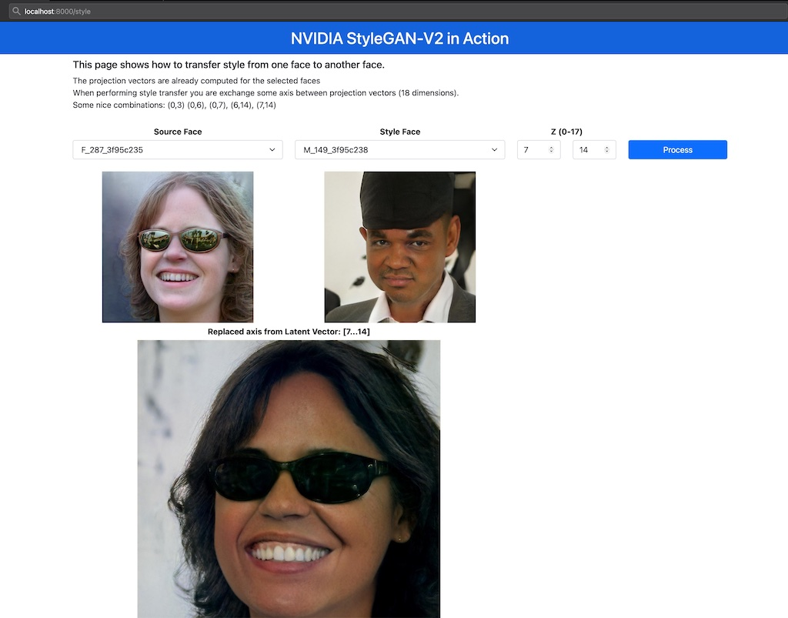
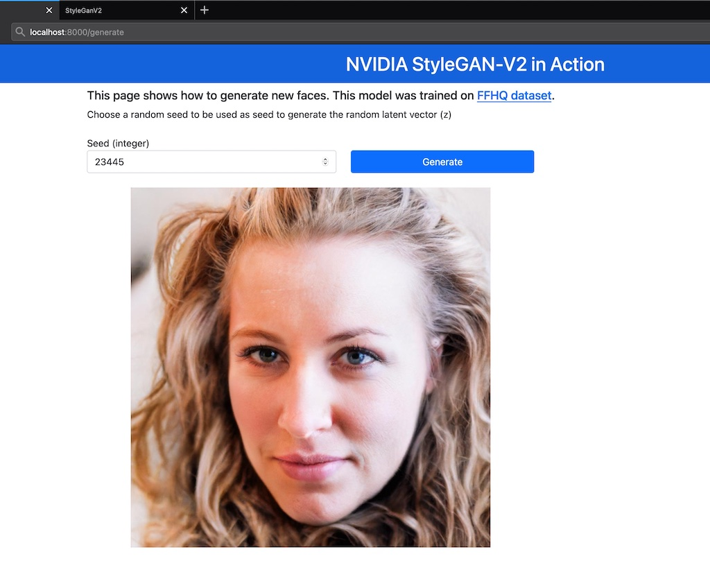

# WebApp for Style Transfer and Face Generation using StyleGAN2-ADA-PyTorch

This repository show the code to implement a font-end to use [NVIDIA StyleGAN2-ADA-PyTorch](https://github.com/NVlabs/stylegan2-ada-pytorch/) pre-trained models.

The goal is to provided a simple front-end to perform quick tests in style transfer application.

This application loads the pre-trained model in [FFHQ dataset](), but there are other pre-trained models you can load in this same application.

Important Note: this model only runs in <b>CUDA GPU</b> devices. It's not possible to run in <b>CPU</b>.

### Demo


## Overview of the code
- [api/api_generate.py](api/api_generate.py): code to generate new images from a random seed and perform style transfer between two projected vectors.
- [api/api_project.py](api/api_project.py): code to generate the projection vector with dims (18,512). You input an image and get the vector in .npz format.
- [web-app/app.py](web-app/app.py): code to expose the API using FastAPI.


## Endpoint available
| Endpoint | Description
| --- | ---
| http://localhost:8000/generate |  Front-end to generate new images from random seed.
| http://localhost:8000/ |  Front-end to perform style transfer.


## Install
1. Clone this repository
```bash
git clone https://github.com/renatoviolin/Deploying-YOLOv5-fastapi-celery-redis-rabbitmq.git
cd Deploying-YOLOv5-fastapi-celery-redis-rabbitmq
```

2. Install dependencies
```bash
pip install -r requirements.txt
```
14
3. Start web-application
```bash
cd web-app
uvicorn app:app --host 0.0.0.0 --port 8000
```

## Running on Google Colab
You can running on colab using ngrok. [](https://colab.research.google.com/drive/1fVHpgU3OKQtp5_gJ5_aXhx24zg0ba5lQ?usp=sharing)


### http://localhost:8000/style


### http://localhost:8000/generate


## Using another pre-trained model
You can change the variable `checkpoint_path` in files [api/api_project.py](api/api_project.py) and [api/api_generate.py](api/api_generate.py) and point to the new model. The official pre-trained models are available [here](https://nvlabs-fi-cdn.nvidia.com/stylegan2-ada-pytorch/pretrained/).


## References
[NVILABS/stylegan2-ada-pytorch](https://github.com/NVlabs/stylegan2-ada-pytorch/)


## Citation
```
@inproceedings{Karras2020ada,
  title     = {Training Generative Adversarial Networks with Limited Data},
  author    = {Tero Karras and Miika Aittala and Janne Hellsten and Samuli Laine and Jaakko Lehtinen and Timo Aila},
  booktitle = {Proc. NeurIPS},
  year      = {2020}
}
```

